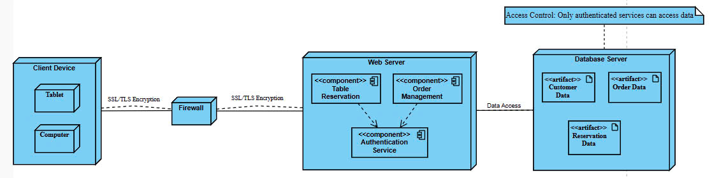

# Task 3: Thiết kế kiến trúc

## Task 3.1

### Kiến trúc MVC

#### Model:
Phần này sẽ quản lý dữ liệu và logic ứng dụng. Trong hệ thống của bạn, Model sẽ bao gồm các mô hình dữ liệu tương ứng với các collection trong cơ sở dữ liệu MongoDB. Node.js sẽ được sử dụng để xử lý các yêu cầu từ Controller, truy xuất hoặc cập nhật dữ liệu trong MongoDB thông qua thư viện Mongoose.

#### View:
Đây là phần giao diện người dùng. Bạn sẽ sử dụng ReactJS để xây dựng giao diện động, cho phép người dùng tương tác với ứng dụng. ReactJS sẽ giúp bạn tạo các component có thể tái sử dụng và quản lý trạng thái ứng dụng một cách hiệu quả.

#### Controller:
Phần này sẽ xử lý các yêu cầu từ View và tương tác với Model. Controllers trong Node.js sẽ nhận các yêu cầu HTTP, xử lý logic và trả về dữ liệu hoặc các phản hồi cần thiết cho View.

### Công nghệ sử dụng

1. **Frontend:**
    - ReactJS: Được sử dụng để xây dựng giao diện người dùng. React cho phép bạn tạo ra các component linh hoạt và dễ dàng quản lý trạng thái ứng dụng.
    - SCSS: Là một phần mở rộng của CSS, SCSS cho phép bạn sử dụng biến, lồng ghép selector và các tính năng khác giúp bạn tổ chức mã CSS tốt hơn.

2. **Backend:**
    - Node.js: Được sử dụng để xây dựng server-side, xử lý các yêu cầu từ client và tương tác với cơ sở dữ liệu MySQL.
    - Express.js: Thường được sử dụng cùng với Node.js để xây dựng API RESTful, giúp dễ dàng quản lý các routes và middleware.

3. **Database:**
    - MongoDB: Là hệ quản trị cơ sở dữ liệu NoSQL mà bạn sẽ sử dụng để lưu trữ dữ liệu dưới dạng tài liệu JSON linh hoạt. Node.js có thể kết nối với MongoDB thông qua các thư viện như Mongoose hoặc MongoDB Native Driver.

### Quá trình triển khai

1. **Thiết kế cơ sở dữ liệu:**
   Xác định các collection và cấu trúc tài liệu trong MongoDB, bao gồm cả các mối quan hệ giữa các collection thông qua tham chiếu hoặc nhúng dữ liệu.

2. **Xây dựng API:**
   Sử dụng Node.js và Express để tạo các endpoint cho ứng dụng. Các controller sẽ xử lý các yêu cầu và tương tác với model.

3. **Phát triển frontend:**
   Sử dụng React để xây dựng giao diện người dùng. Kết nối với API để lấy và gửi dữ liệu.

4. **Triển khai:**
   Đưa ứng dụng lên server, có thể sử dụng các dịch vụ như Heroku, AWS hoặc DigitalOcean cho backend và Vercel hoặc Netlify cho frontend.

### Tổ chức mã nguồn

1. **Frontend:**
   Thư mục `src` chứa các component React, styles SCSS và các tệp cấu hình.

2. **Backend:**
   Thư mục có các controller, model và các tệp cấu hình cho Express và MongoDB (sử dụng thư viện Mongoose để quản lý kết nối và tương tác với cơ sở dữ liệu).

## Task 3.2

### Sơ đồ triển khai cho các chức năng chính

