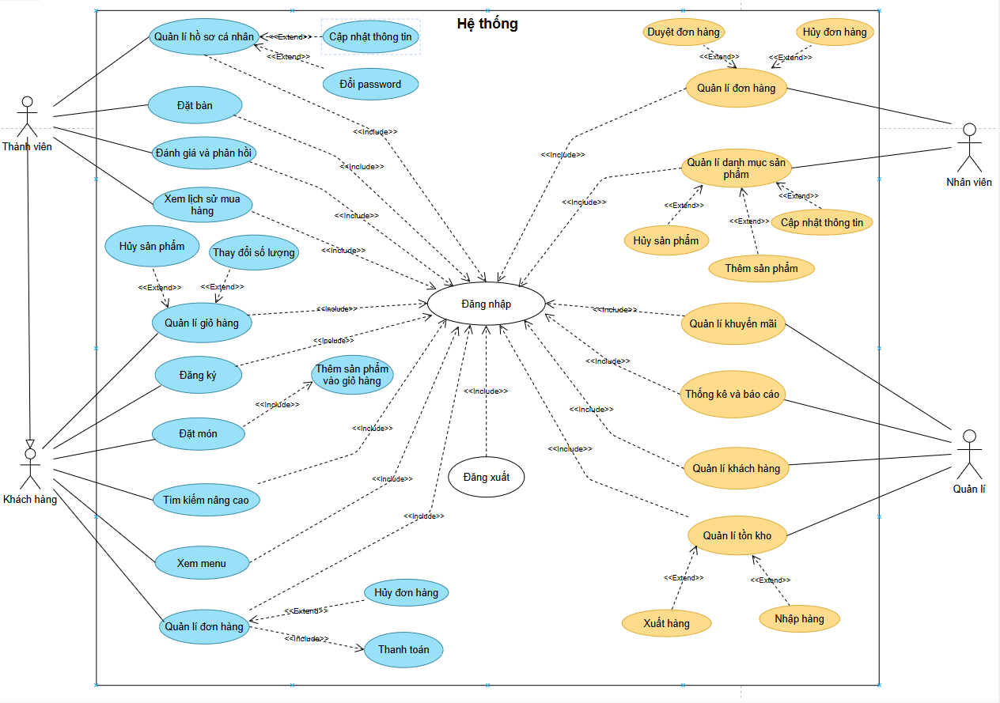
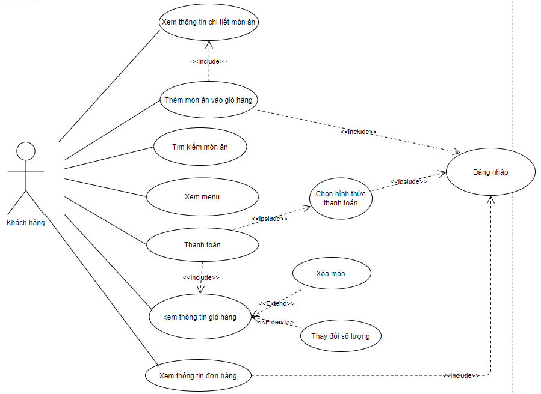

## Task 1: Khai thác yêu cầu

### Task 1.1

#### Xác định bối cảnh của dự án

Dự án này liên quan đến việc phát triển một hệ thống quản lý bán hàng (POS) dựa trên web cho các nhà hàng, quán cà phê, quán bar và các cơ sở kinh doanh ăn uống khác. Hệ thống sẽ thay thế các máy POS hiện tại bằng một giải pháp linh hoạt, dễ sử dụng và không yêu cầu tiếp xúc trực tiếp giữa nhân viên và khách hàng. Hệ thống này sẽ tích hợp các tính năng như đặt bàn, đặt món, thanh toán và quản lý khách hàng, nhằm đáp ứng các yêu cầu kinh doanh hiện tại và giúp mở rộng quy mô trong tương lai.

#### Xác định các bên liên quan chính

- **Chủ nhà hàng:** Chủ nhà hàng là bên yêu cầu hệ thống mới. Họ mong muốn hệ thống không chỉ cải thiện quy trình hiện tại mà còn giúp tăng cường hiệu quả kinh doanh, giảm lãng phí và có khả năng mở rộng khi họ mở thêm nhiều chi nhánh.

- **Khách hàng:** Đây là những người sẽ trực tiếp sử dụng hệ thống để đặt món, thanh toán, và quản lý đơn hàng của mình. Họ mong muốn trải nghiệm mượt mà, dễ sử dụng, và tiện lợi trên các thiết bị di động.

- **Nhân viên nhà hàng:** Họ sẽ tương tác với hệ thống để quản lý đơn hàng, xử lý các yêu cầu từ khách hàng và giám sát hoạt động của nhà hàng.

- **Nhà phát triển phần mềm:** Nhóm phát triển chịu trách nhiệm thiết kế, xây dựng và triển khai hệ thống theo yêu cầu của chủ nhà hàng, đảm bảo rằng hệ thống hoạt động tốt và có khả năng mở rộng trong tương lai.

#### Những gì được kỳ vọng sẽ được thực hiện

- **Xây dựng hệ thống POS dựa trên web:** Hệ thống này sẽ thay thế các máy POS hiện tại, với các chức năng như đặt bàn, đặt món, thanh toán, và quản lý khách hàng.

- **Trải nghiệm không tiếp xúc:** Khách hàng có thể thực hiện tất cả các thao tác như đặt món, thanh toán mà không cần tiếp xúc trực tiếp với nhân viên, thông qua các thiết bị di động, máy tính bảng, hoặc máy tính/laptop.

- **Hỗ trợ mã QR:** Hệ thống sẽ hỗ trợ sử dụng mã QR để khách hàng dễ dàng truy cập mà không cần phải cài đặt ứng dụng.

- **Tính linh hoạt và khả năng mở rộng:** Hệ thống cần có khả năng triển khai trên nhiều nhà hàng khác nhau, không chỉ cho một nhà hàng đơn lẻ.

#### Phạm vi của dự án

- **Thiết kế và phát triển hệ thống POS dựa trên web:** Dự án sẽ tập trung vào việc xây dựng hệ thống từ đầu, tích hợp các tính năng như đặt món, thanh toán, và quản lý đơn hàng, phù hợp với yêu cầu không tiếp xúc và sử dụng trên nhiều thiết bị khác nhau.

- **Khả năng mở rộng:** Hệ thống sẽ được thiết kế để có thể mở rộng trong tương lai, với khả năng quản lý nhiều nhà hàng cùng một lúc.

### Task 1.2

#### Các Yêu Cầu Chức Năng

1. **Đặt Bàn:**
   - Khách hàng có thể đặt bàn qua web hoặc mã QR.

2. **Đặt Món:**
   - Khách hàng có thể duyệt menu và đặt món ăn.
   - Hệ thống hiển thị chi tiết món ăn khi khách hàng nhấp chọn một mặt hàng.
   - Khách hàng có thể thay đổi số lượng món ăn và thêm vào giỏ hàng.

3. **Thanh Toán:**
   - Hỗ trợ nhiều phương thức thanh toán: thẻ tín dụng, ví điện tử, chuyển khoản ngân hàng.

4. **Quản Lý Khách Hàng:**
   - Lưu trữ thông tin khách hàng và lịch sử giao dịch.
   - Hệ thống gửi thông báo, chương trình khuyến mãi và ưu đãi đặc biệt cho khách hàng.

5. **Quản Lý Giao Dịch:**
   - Ghi nhận và quản lý các giao dịch hàng ngày.
   - Cập nhật tồn kho tự động sau mỗi giao dịch.

6. **Quản Lý Đặt Hàng Mang Đi:**
   - Khách hàng có thể chọn tùy chọn mang đi.
   - Xác nhận thời gian và địa điểm giao hàng.

#### Các Yêu Cầu Phi Chức Năng

1. **Tránh Tiếp Xúc Trực Tiếp:**
   - Hệ thốngcho phép khách hàng thực hiện các yêu cầu trực tuyến mà không cần tiếp xúc trực tiếp với nhân viên.

2. **Hiệu Suất:**
   - Hệ thống có thể xử lý khoảng 50 đơn hàng mỗi ngày một cách mượt mà.

3. **Sử Dụng Công Nghệ Web và QR Code:**
   - Hỗ trợ truy cập qua trình duyệt web và mã QR mà không cần cài đặt ứng dụng.

4. **Tương Thích với Nhiều Thiết Bị:**
   - Hệ thống có thể sử dụng trên các thiết bị di động, máy tính bảng và máy tính/laptop.

5. **Khả Năng Mở Rộng:**
   - Hệ thống có khả năng mở rộng để sử dụng cho nhiều nhà hàng trong tương lai.

### Task 1.3

#### Sơ đồ use case toàn hệ thống

#### Vẽ sơ đồ use case: đặt món

#### Lập bảng mô tả use case: đặt món

| **Tên Use case**            | **Đặt món**                                                                                                |
| --------------------------- | ---------------------------------------------------------------------------------------------------------- |
| **Mô tả**                   | Khách hàng chọn món ăn từ thực đơn, thêm vào giỏ hàng, tiến hành thanh toán và hoàn tất đơn hàng.          |
| **Actor**                   | Khách hàng                                                                                                 |
| **Điều kiện tiên cần**      | Khách hàng đã tạo tài khoản hoặc đăng nhập vào hệ thống.                                                   |
| **Sự kiện kích hoạt**       | Khách hàng truy cập vào ứng dụng, chọn nhà hàng và xem thực đơn.                                           |
| **Hành động**               | 1. Khách hàng duyệt qua thực đơn và chọn món ăn.                                                            |
|                             | 2. Khách hàng thêm món ăn vào giỏ hàng.                                                                     |
|                             | 3. Khách hàng chọn hình thức thanh toán.                                                                    |
|                             | 4. Hệ thống xác nhận đơn hàng và gửi thông báo đến nhà hàng.                                                |
|                             | 5. Nhà hàng nhận đơn hàng và bắt đầu chuẩn bị.                                                               |
| **Điều kiện hậu cần**       | Đơn hàng được ghi nhận vào hệ thống, khách hàng có thể theo dõi trạng thái đơn hàng.                        |
| **Các đường dẫn thay thế**  | 1. Khách hàng có thể chỉnh sửa giỏ hàng trước khi thanh toán.                                              |
|                             | 2. Khách hàng có thể hủy đơn hàng trước khi nhà hàng bắt đầu chuẩn bị.                                      |
|                             | 3. Hệ thống có thể thông báo cho khách hàng khi đơn hàng đã sẵn sàng để giao.                               |